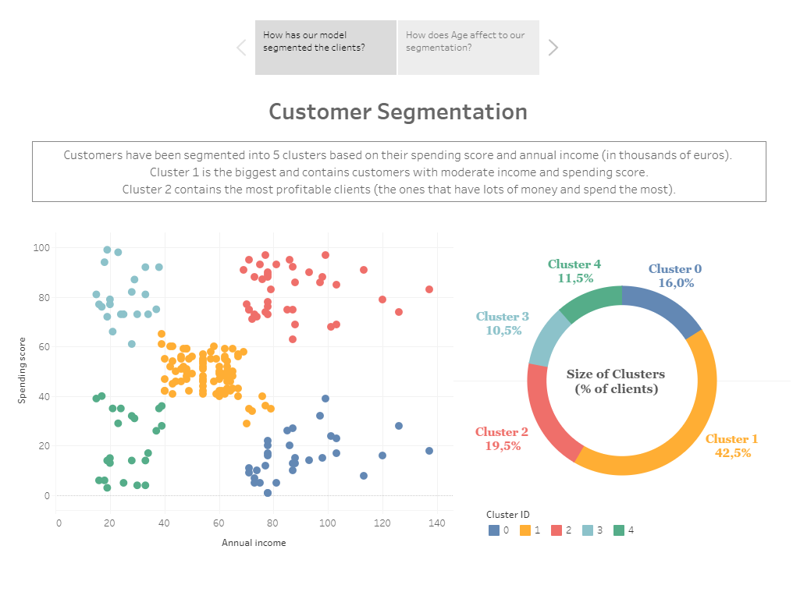
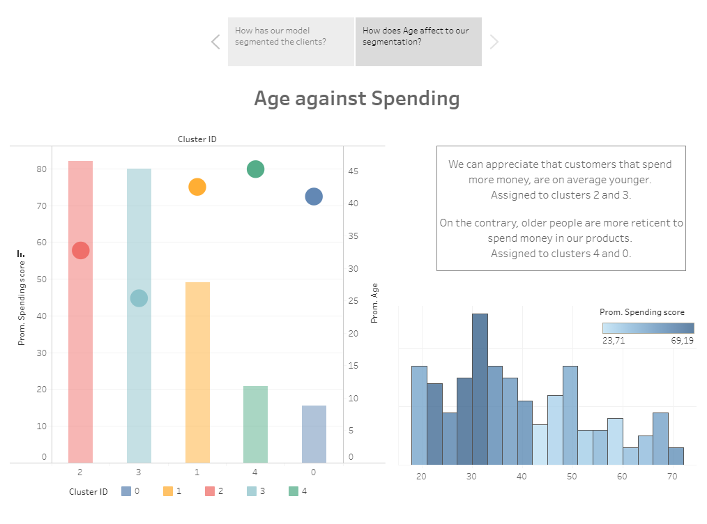

# Customer Clustering
Contains a jupyter notebook where hierarchical clustering is applied to an e-commerce dataset, in order to obtain insights and use them to make decisions in hypotetical realistic situations. 

The clustering results are then exported to an excel file (*output.xlsx*) which is used to create a Tableau Dashboard.

<ins>Links<ins>
  
The dataset ([link](https://github.com/tirthajyoti/Machine-Learning-with-Python/blob/master/Datasets/Mall_Customers.csv)) and the dashboard ([link](https://public.tableau.com/views/CustomerSegmentationClustering/Story?:language=es&:display_count=y&publish=yes&:origin=viz_share_link)) are publicly available.

## Dashboard Screenshots

