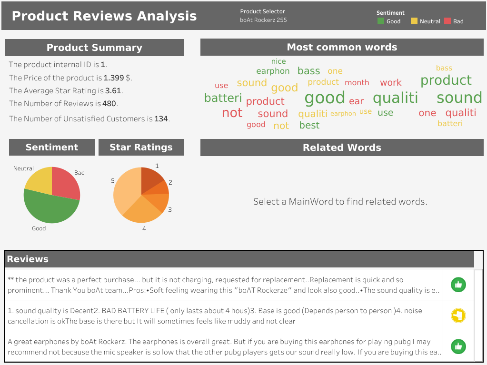

# Text Analytics for Customer Care

The project consists on creating dashboard that the Customer Service Department can consume with the objective of being able to detect the unsatisfied customers, the main topics why they are unsatisfied, see the customer's history, and many other graphs that help them to improve the Customer Service.

Before creating the dashboard, the text of the reviews must preprocessed in order to standardize the text, eliminate emojis and stopwords. Then using an LSTM model we perform Sentiment analysis using as input the standardized reviews text.

The dataset consists on several earphones reviews from Amazon which can be downloaded from [Kaggle](https://www.kaggle.com/shitalkat/amazonearphonesreviews).

## Dashboard

The dashboard is accessible in Tableau Public in this [link](https://public.tableau.com/views/TextAnalyticsonCustomersReviews/ProductReviewsAnalysis?:language=es&:display_count=y&publish=yes&:origin=viz_share_link).

The screenshot below shows how the dashboard looks like.

